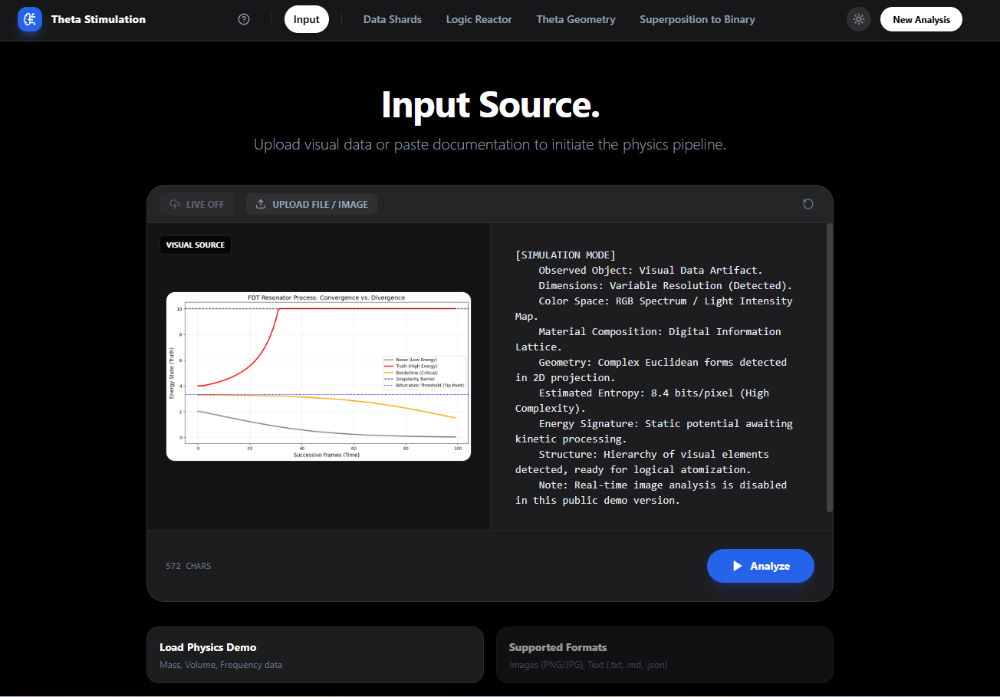

# Theta Stimulation Engine


**Theta Stimulation Engine** is a conceptual data visualization platform that reimagines document processing as a physical and geometric event. Instead of simply parsing text, it treats data (text, code, images, biological stats) as "shards" of matter that obey universal laws of physics, such as conservation of mass, entropy, and thermodynamic thresholds.

This project visualizes the transformation of raw information into structured "Theta Geometry," reducing abstract concepts down to core physical observables like **Mass**, **Energy**, **Space**, and **Time**.

## 🌐 Live Demo

**Experience the Physics Engine Live:**  
### [https://thetastimulations.netlify.app/](https://thetastimulations.netlify.app/)

---

## 📸 Visual Preview


*Figure 1: The Input Interface analyzing data artifacts.*


*Figure 2: Real-time geometric projection of logical arguments.*

---

## 🌟 Key Features

### 1. The Physics of Data (System Guide)
A comprehensive interactive guide detailing how 13 different domains (Physics, Biology, Software, Geometry, etc.) are reduced to fundamental physical properties.
*   **Example:** A "Computer File" is analyzed not by its name, but by its **Entropy** (Information Density).
*   **Example:** "Music" is analyzed as **Wave Mechanics** (Frequency & Amplitude).

### 2. Multi-Stage Processing Pipeline
The engine visualizes data transformation through four distinct stages:

*   **Stage 1: Data Shards (Atomization)**
    *   Breaks raw input (text or simulated image data) into labeled atomic units.
    *   Identifies properties like "Velocity", "Radius", "Taxonomy", or "Bitrate".

*   **Stage 2: Logic Reactor (Fusion & Diffusion)**
    *   A thermal heatmap visualization of logical operations.
    *   **Fusion:** Combines inputs (e.g., `Mass` + `Volume` → `Density`).
    *   **Thresholds:** Detects state changes (e.g., `Temp` > `Melting Point`).

*   **Stage 3: Theta Geometry (3D Projection)**
    *   An interactive 3D wave grid.
    *   Projects logical nodes into Space-Time coordinates based on complexity and resonance.
    *   Nodes form structural "spines" and "anchors" to visualize the stability of the argument.

*   **Stage 4: Superposition (Quantum Reduction)**
    *   A "Quantum Tunnel" interface.
    *   Cross-pollinates unconnected concepts (e.g., "Biology" + "Software") to find "Uninvented Combinations".
    *   Reduces these abstract combinations to binary physics truths using quantum gate logic (XOR, AND, CNOT).

### 3. Simulation Mode
The project currently runs in **Simulation Mode**. The vision components are mocked with deterministic data patterns to allow for instant, consistent demonstration of the physics engine without requiring external API keys.

---

## 🚀 Getting Started

### Prerequisites
*   Node.js (v16 or higher)
*   npm (v7 or higher)

### Installation

1.  **Clone the repository**
    ```bash
    git clone https://github.com/your-username/theta-stimulation.git
    cd theta-stimulation
    ```

2.  **Install dependencies**
    ```bash
    npm install
    ```

3.  **Run the development server**
    ```bash
    npm run dev
    ```

4.  **Open in Browser**
    Navigate to `http://localhost:5173` to view the engine.

### Building for Production

To create a production-ready build:

```bash
npm run build
```

This will generate static assets in the `dist/` folder, ready for deployment to Vercel, Netlify, or GitHub Pages.

---

## 📂 Project Structure

```
theta-stimulation/
├── assets/              # Project screenshots and demo media
├── components/          # React UI Components
│   ├── AnalysisStages.tsx   # Visualizers for Stages 1-4
│   └── SystemGuide.tsx      # Documentation & Models interface
├── services/            # Core Logic
│   ├── documentProcessor.ts     # The "Physics Engine" logic
│   └── visionSimulationService.ts # Simulated Vision service
├── types.ts             # TypeScript interfaces for Data/Physics models
├── App.tsx              # Main application controller
├── index.html           # Entry point
└── vite.config.ts       # Vite configuration
```

---

## 🧠 The Logic Framework

The engine operates on a custom set of "Universal Rules":

1.  **Conservation:** Nothing appears or disappears. Inputs fuse to create outputs derived from the same total (Space × Time × Mass = Constant).
2.  **Thresholds:** Properties only emerge when a value crosses a critical point (The "Observation Zone").
3.  **Wave-Particle Duality:** Data acts as discrete "Shards" (Stage 1) or continuous "Waves" (Stage 3) depending on the observation method.
4.  **Scale Invariance:** The logic applied to a microscopic atom is identical to the logic applied to a solar system or a software class hierarchy.

---

## 🛠 Technologies

*   **Core:** React 18, TypeScript
*   **Build Tool:** Vite
*   **Styling:** Tailwind CSS
*   **Icons:** Lucide React
*   **Visualization:** SVG & CSS3 3D Transforms

---

## 📄 License

This project is open-source and available under the **MIT License**.
